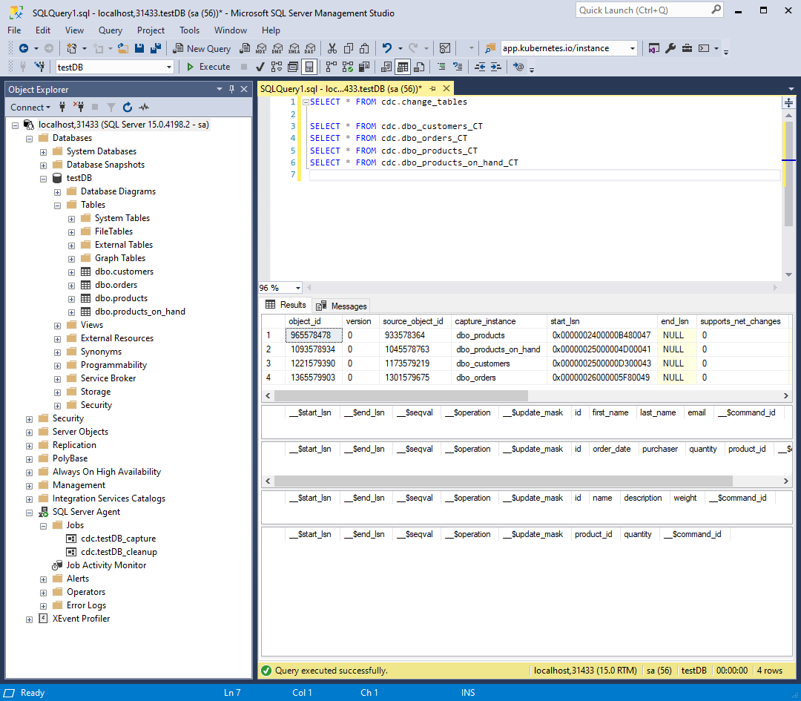
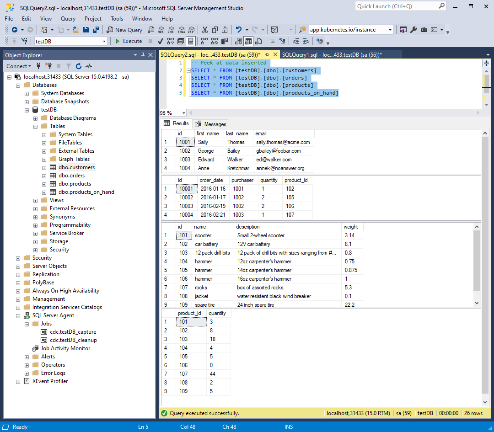
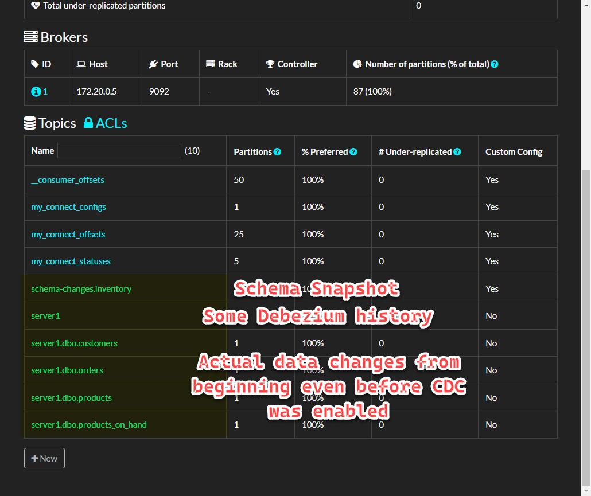
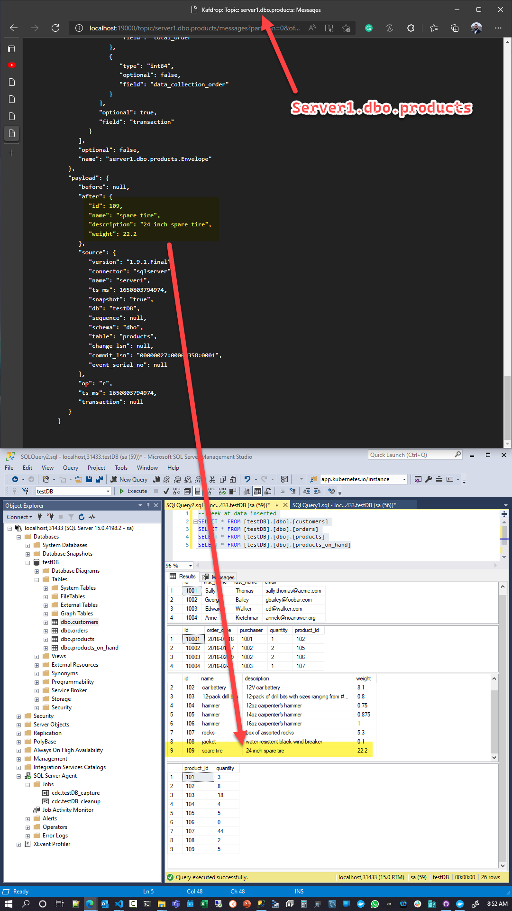
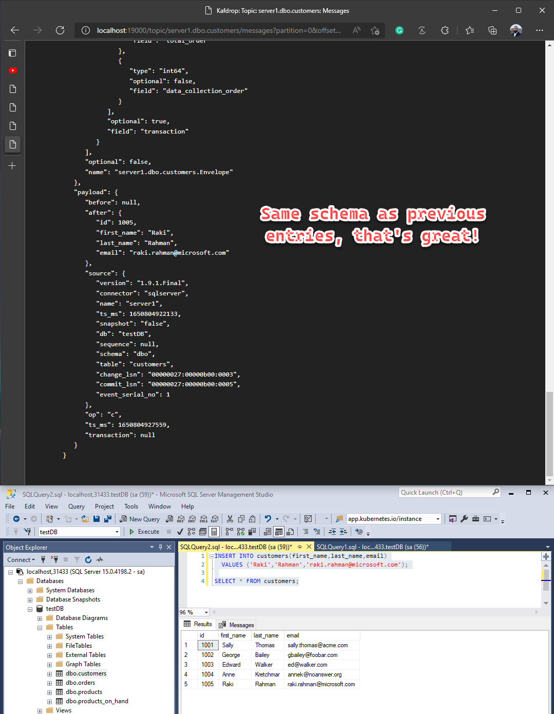

# Debezium with SQL on Linux

## Quickstart

To get a working SQL Server + Debezium + Kafdrop setup:
```bash
export DEBEZIUM_VERSION=1.9
docker-compose -f 0.docker-compose-sqlserver.yaml down
docker-compose -f 0.docker-compose-sqlserver.yaml up -d

# Initiate SQL Server with CDC tables
cat 1.db-init.sql | docker-compose -f 0.docker-compose-sqlserver.yaml exec -T sqlserver bash -c '/opt/mssql-tools/bin/sqlcmd -U sa -P $SA_PASSWORD'

# Turn on Debezium for CDC ingestion
curl -i -X POST -H "Accept:application/json" -H  "Content-Type:application/json" http://connect:8083/connectors/ -d @2.register-sqlserver.json
```
## Useful links from laptop
* SQL: localhost,31433
   * sa:Password!
* Kafdrop: localhost:19000
* Kafka:   kafka:9092

## Longer explanations
> [Reference](https://github.com/debezium/debezium-examples/tree/main/tutorial#using-sql-server)
```bash
# Infra spinup - 5 Containers
# Kafka, Zookeeper, Kafdrop, SQL, Debezium
export DEBEZIUM_VERSION=1.9
docker-compose -f 0.docker-compose-sqlserver.yaml up -d

# Initialize database and insert test data, enable CDC
cat 1.db-init.sql | docker-compose -f 0.docker-compose-sqlserver.yaml exec -T sqlserver bash -c '/opt/mssql-tools/bin/sqlcmd -U sa -P $SA_PASSWORD'
```

And we can see our CDC tables:
```sql
-- All CDC tables
SELECT * FROM cdc.change_tables

-- Logs for our 4 tables - appended with _CT
SELECT * FROM cdc.dbo_customers_CT
SELECT * FROM cdc.dbo_orders_CT
SELECT * FROM cdc.dbo_products_CT
SELECT * FROM cdc.dbo_products_on_hand_CT

-- Peek at data inserted
SELECT * FROM [testDB].[dbo].[customers]
SELECT * FROM [testDB].[dbo].[orders]
SELECT * FROM [testDB].[dbo].[products]
SELECT * FROM [testDB].[dbo].[products_on_hand]
```



Start Debezium SQL Server Connector by `POST` request to Kafka Connect:
```bash
curl -i -X POST -H "Accept:application/json" -H  "Content-Type:application/json" http://connect:8083/connectors/ -d @2.register-sqlserver.json

# HTTP/1.1 201 Created
# Date: Sun, 24 Apr 2022 12:36:34 GMT
# Location: http://connect:8083/connectors/inventory-connector
# Content-Type: application/json
# Content-Length: 466
# Server: Jetty(9.4.43.v20210629)

# {"name":"inventory-connector","config":{"connector.class":"io.debezium.connector.sqlserver.SqlServerConnector","tasks.max":"1","database.server.name":"server1","database.hostname":"sqlserver","database.port":"1433","database.user":"sa","database.password":"Password!","database.dbname":"testDB","database.history.kafka.bootstrap.servers":"kafka:9092","database.history.kafka.topic":"schema-changes.inventory","name":"inventory-connector"},"tasks":[],"type":"source"}
```


Looks like Debezium creates an [initial snapshot](https://debezium.io/documentation/reference/stable/connectors/sqlserver.html#how-the-sqlserver-connector-works) even though initial CDC logs are empty!

SQL Server CDC is not designed to store a complete history of database changes. For the Debezium SQL Server connector to establish a baseline for the current state of the database, it uses a process called snapshotting.

You can configure how the connector creates snapshots. By default, the connector’s snapshot mode is set to `initial`. Based on this initial snapshot mode, the first time that the connector starts, it performs an initial consistent snapshot of the database. This initial snapshot captures **the structure** and **data** for any tables that match the criteria defined by the `include` and `exclude` properties that are configured for the connector (for example, `table.include.list`, `column.include.list`, `table.exclude.list`, and so forth).

When the connector creates a snapshot, it completes the following tasks:
1. Determines the tables to be captured.
2. Obtains a lock on the SQL Server tables for which CDC is enabled to prevent structural changes from occurring during creation of the snapshot. The level of the lock is determined by `snapshot.isolation.mode` configuration option.
3. Reads the maximum log sequence number (LSN) position in the server’s transaction log.
4. Captures the structure of all relevant tables.
5. Releases the locks obtained in Step 2, if necessary. In most cases, locks are held for only a short period of time.
6. Scans the SQL Server source tables and schemas to be captured based on the LSN position that was read in Step 3, generates a READ event for each row in the table, and writes the events to the Kafka topic for the table.
7. Records the successful completion of the snapshot in the connector offsets.



Let's `INSERT` something new:
```sql
INSERT INTO customers(first_name,last_name,email)
  VALUES ('Raki','Rahman','raki.rahman@microsoft.com');
```


```json
{
   "schema": {
      "type": "struct",
      "fields": [
         {
            "type": "struct",
            "fields": [
               {
                  "type": "int32",
                  "optional": false,
                  "field": "id"
               },
               {
                  "type": "string",
                  "optional": false,
                  "field": "first_name"
               },
               {
                  "type": "string",
                  "optional": false,
                  "field": "last_name"
               },
               {
                  "type": "string",
                  "optional": false,
                  "field": "email"
               }
            ],
            "optional": true,
            "name": "server1.dbo.customers.Value",
            "field": "before"
         },
         {
            "type": "struct",
            "fields": [
               {
                  "type": "int32",
                  "optional": false,
                  "field": "id"
               },
               {
                  "type": "string",
                  "optional": false,
                  "field": "first_name"
               },
               {
                  "type": "string",
                  "optional": false,
                  "field": "last_name"
               },
               {
                  "type": "string",
                  "optional": false,
                  "field": "email"
               }
            ],
            "optional": true,
            "name": "server1.dbo.customers.Value",
            "field": "after"
         },
         {
            "type": "struct",
            "fields": [
               {
                  "type": "string",
                  "optional": false,
                  "field": "version"
               },
               {
                  "type": "string",
                  "optional": false,
                  "field": "connector"
               },
               {
                  "type": "string",
                  "optional": false,
                  "field": "name"
               },
               {
                  "type": "int64",
                  "optional": false,
                  "field": "ts_ms"
               },
               {
                  "type": "string",
                  "optional": true,
                  "name": "io.debezium.data.Enum",
                  "version": 1,
                  "parameters": {
                     "allowed": "true,last,false,incremental"
                  },
                  "default": "false",
                  "field": "snapshot"
               },
               {
                  "type": "string",
                  "optional": false,
                  "field": "db"
               },
               {
                  "type": "string",
                  "optional": true,
                  "field": "sequence"
               },
               {
                  "type": "string",
                  "optional": false,
                  "field": "schema"
               },
               {
                  "type": "string",
                  "optional": false,
                  "field": "table"
               },
               {
                  "type": "string",
                  "optional": true,
                  "field": "change_lsn"
               },
               {
                  "type": "string",
                  "optional": true,
                  "field": "commit_lsn"
               },
               {
                  "type": "int64",
                  "optional": true,
                  "field": "event_serial_no"
               }
            ],
            "optional": false,
            "name": "io.debezium.connector.sqlserver.Source",
            "field": "source"
         },
         {
            "type": "string",
            "optional": false,
            "field": "op"
         },
         {
            "type": "int64",
            "optional": true,
            "field": "ts_ms"
         },
         {
            "type": "struct",
            "fields": [
               {
                  "type": "string",
                  "optional": false,
                  "field": "id"
               },
               {
                  "type": "int64",
                  "optional": false,
                  "field": "total_order"
               },
               {
                  "type": "int64",
                  "optional": false,
                  "field": "data_collection_order"
               }
            ],
            "optional": true,
            "field": "transaction"
         }
      ],
      "optional": false,
      "name": "server1.dbo.customers.Envelope"
   },
   "payload": {
      "before": null,
      "after": {
         "id": 1005,
         "first_name": "Raki",
         "last_name": "Rahman",
         "email": "raki.rahman@microsoft.com"
      },
      "source": {
         "version": "1.9.1.Final",
         "connector": "sqlserver",
         "name": "server1",
         "ts_ms": 1650804922133,
         "snapshot": "false",
         "db": "testDB",
         "sequence": null,
         "schema": "dbo",
         "table": "customers",
         "change_lsn": "00000027:00000b00:0003",
         "commit_lsn": "00000027:00000b00:0005",
         "event_serial_no": 1
      },
      "op": "c",
      "ts_ms": 1650804927559,
      "transaction": null
   }
}
```